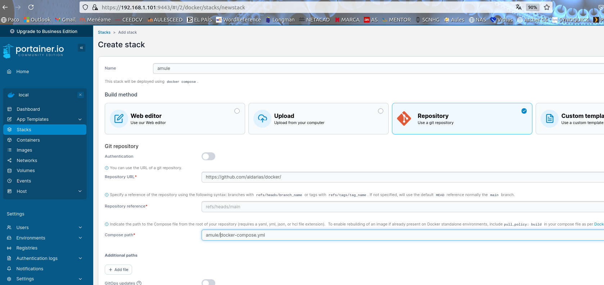

Despliegue de docker composer

Servidores Nas/Rasberry/Proxmox

Licencia Creative Common CC BY-NC-SA 

Reconocimiento-NoComercial-CompartirIgual.

* v1.0
	* Fecha: 9-06-2024 Versión inicial

Por Paco Aldarias Raya

[Email] paco.aldarias@gmail.com

[Blog](http://aldarias.es)

Imagen de como usar github en portainer:

